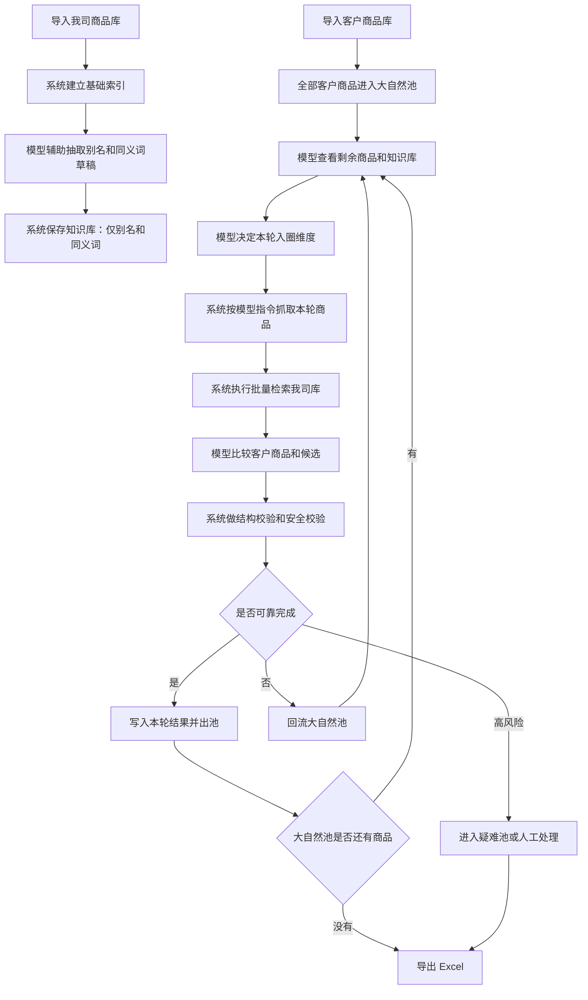

# 002号系统模型流程方案：模型发令、多轮入圈、失败回流

版本：v0.1  
日期：2026-04-26  
状态：讨论确认稿  

## 1. 方案定位

002 号方案用于修正 001 号方案中“系统过于主导、模型被动判断候选”的问题。

本方案的核心判断：

**模型是发令者，系统是执行者。**

更完整地说：

- 模型负责理解商品语义、组织处理顺序、决定本轮按什么共同特征入圈。
- 系统负责读写 Excel、查我司商品库、批量执行模型指令、记录过程、导出结果。
- 知识库只负责保存别名和同义词，不扩展成复杂规则库。
- 人工不是主流程，只处理少数系统和模型都无法可靠解决的剩余问题。

## 2. 为什么要从 001 升级到 002

001 号方案已经确认了方向：

- 模型主导语义理解。
- 系统负责执行和安全校验。
- 不按客户分类或我司分类硬分批。
- 按商品共同特征进行动态分批。

但 001 号方案仍存在三个风险：

- 如果模型一开始分错堆，可能带偏后续匹配。
- 如果每条商品都让模型逐条判断，成本会过高。
- 如果知识库沉淀范围过大，容易越学越歪。

002 号方案的改进是：

**不让一次分堆决定最终结果，而是采用多轮入圈、失败回流。**

分错堆没有关系，只要不能在错误堆里匹配成功，就回到未处理池，等待下一轮用其他维度重新入圈。

## 3. 核心概念

### 3.1 大自然池

大自然池是所有尚未可靠匹配成功的客户商品集合。

一开始，客户商品库的所有记录都在大自然池里。

每一轮处理时，模型从大自然池中挑选一批有共同特征的商品进入本轮处理圈。

本轮处理后：

- 匹配成功的商品出池。
- 匹配失败的商品回到大自然池。
- 高风险商品可以进入疑难池或人工处理池。

大自然池的作用是兜底。

它保证商品即使进错了一轮，也不会被永久困在错误分组里。

### 3.2 入圈

入圈不是落码。

入圈只是说明：这批商品本轮先按某个共同特征集中处理。

例如：

- 本轮按核心品名入圈：生抽、老抽、陈醋、番茄、土豆。
- 本轮按品牌入圈：海天、李锦记、厨邦。
- 本轮按规格入圈：500ml、1L、5kg。
- 本轮按别名入圈：番茄/西红柿、土豆/马铃薯。

入圈只是参加筛选。

最终是否落码，必须看候选对照证据和安全校验。

### 3.3 出圈

出圈表示本条客户商品已经完成本轮可靠处理。

出圈可以有几种结果：

- 自动落码无风险。
- 自动落码但有表达差异。
- 建议落码待确认。
- 必须人工审核。
- 未找到可靠匹配。

只有达到业务定义的可靠状态，才能出池。

### 3.4 回流

回流表示本轮没有可靠匹配成功，商品回到大自然池。

例如：

客户商品 `番茄酱 500g` 被错误带入 `番茄/西红柿` 处理圈。

模型和系统发现它与新鲜番茄不是同一商品身份，本轮不能匹配。

这条商品不应被强行落码，而是回流到大自然池，等待后续按 `酱料`、`调味品`、`番茄酱` 等特征重新处理。

## 4. 角色边界

### 4.1 模型

模型负责发令。

模型主要做：

- 理解客户商品和我司商品名称中的语义。
- 识别共同特征。
- 决定本轮优先处理哪个特征。
- 给系统下达本轮批处理策略。
- 解释候选之间是否表达同一商品身份。
- 输出中文证据、风险和状态建议。

模型不做：

- 不直接写入我司商品库。
- 不凭空创造我司商品编码。
- 不直接绕过安全校验自动落码。
- 不把复杂业务规则沉淀为知识库规则。

### 4.2 系统

系统负责执行。

系统主要做：

- 读取客户商品库和我司商品库。
- 保存字段确认结果。
- 按模型指令执行批量检索。
- 根据别名词库和同义词库扩展检索。
- 生成候选列表。
- 调用模型比较候选。
- 校验模型输出结构。
- 做最低限度安全校验。
- 写入任务结果。
- 导出 Excel。
- 记录日志和过程证据。

系统不做：

- 不凭死板规则主导商品语义判断。
- 不用客户分类或我司分类作为唯一分批依据。
- 不因为模型一句话就直接落码。

### 4.3 知识库

知识库只做别名和同义词。

第一版知识库建议只包含：

- 强同义词：番茄 = 西红柿。
- 地区别名：土豆 = 马铃薯。
- 规格等价：500ml = 500毫升 = 0.5L。
- 品牌别名：海天 = Haitian = HT。
- 非强同义提示：生抽和酱油相关，但不能直接等同。

知识库不做：

- 不保存复杂业务推理规则。
- 不直接决定自动落码。
- 不替代模型语义判断。
- 不替代人工确认争议样本。

## 5. 总体流程

## 6. 多轮处理顺序

002 号方案不要求一次确定全部分组。

建议按多轮筛选推进。

### 6.1 第一轮：核心名称

优先处理商品身份最明显的名称。

例如：

- 生抽
- 老抽
- 陈醋
- 番茄
- 土豆
- 可乐
- 矿泉水

目标：

先解决最容易形成大批量稳定匹配的商品。

### 6.2 第二轮：品牌

对第一轮未完成的商品，按品牌或疑似品牌组织。

例如：

- 海天
- 李锦记
- 厨邦
- 雪碧
- 可口可乐

目标：

处理同品牌下多规格、多系列商品。

### 6.3 第三轮：规格和包装

对仍未完成的商品，按规格、单位、包装形态组织。

例如：

- 500ml
- 1L
- 5kg
- 瓶装
- 箱装
- 散称

目标：

处理名称相似但规格包装决定身份的商品。

### 6.4 第四轮：别名和同义词

使用知识库中的别名和同义词重新组织。

例如：

- 番茄/西红柿
- 土豆/马铃薯
- 500ml/500毫升/0.5L

目标：

解决字面不相似但语义相同的商品。

### 6.5 第五轮：疑难细看

最后剩余的商品进入疑难池。

此时可以采用更贵但更精细的模型逐条判断。

目标：

把人工干预量压到最低。

## 7. 成本控制策略

002 号方案的成本控制原则：

**模型不逐条从零判断，模型按批次发令，系统批量执行。**

具体策略：

1. 模型先看一批样本和剩余池概况，决定本轮处理策略。
2. 系统按策略批量筛选和检索。
3. 明确匹配的商品不再反复调用模型。
4. 匹配失败的商品回流，等待下一轮换维度处理。
5. 只有疑难池才允许更细的逐条模型判断。
6. 已沉淀的强同义词和别名优先本地使用，减少重复调用模型。

这样可以避免：

- 每条商品都调用模型。
- 每条商品都全库搜索。
- 每条商品都进入人工审核。

## 8. 安全原则

### 8.1 入圈不等于落码

商品进了某个处理圈，只代表本轮尝试按这个共同特征处理。

不能因为入了 `番茄/西红柿` 圈，就强行把 `番茄酱` 匹配成新鲜番茄。

### 8.2 分错圈必须允许回流

任何商品只要本轮证据不足，都必须回流大自然池。

不能因为本轮找不到，就直接标死。

### 8.3 自动落码必须有证据

自动落码必须同时满足：

- 推荐编码真实存在于我司商品库。
- 客户商品和我司商品核心品名一致或强同义。
- 品牌没有明确冲突。
- 规格没有明确冲突。
- 单位和包装没有明确冲突。
- 模型给出的证据来自客户原文、我司商品库或已确认知识库。

### 8.4 模型不能凭空造事实

模型可以解释和判断，但不能创造不存在的商品编码、品牌、规格或单位。

系统必须校验模型输出中的编码是否真实存在。

### 8.5 知识库不能越权

知识库只保存别名和同义词。

知识库中的词条可以帮助检索和解释，但不能单独决定自动落码。

## 9. 002 方案示例

### 9.1 番茄和西红柿

客户商品：

`新鲜番茄 斤`

我司商品：

`西红柿 散称 斤`

处理：

1. 模型识别 `番茄` 和 `西红柿` 为强同义。
2. 系统按同义词检索我司库。
3. 模型比较候选，确认都是新鲜蔬菜。
4. 系统校验单位一致。
5. 可以进入自动落码或自动落码但有表达差异。

### 9.2 番茄酱误入番茄圈

客户商品：

`番茄酱 500g 瓶`

本轮误入：

`番茄/西红柿` 圈。

处理：

1. 系统检索到 `西红柿 散称 斤`。
2. 模型发现 `番茄酱` 是加工调味品，`西红柿` 是新鲜蔬菜。
3. 不允许匹配。
4. 商品回流大自然池。
5. 后续按 `酱料`、`调味品` 或 `番茄酱` 重新入圈。

### 9.3 海天金标生抽

客户商品：

`海天金标生抽 500ml 瓶`

处理：

1. 第一轮可能按 `生抽` 入圈。
2. 系统检索我司库中的生抽候选。
3. 模型识别 `海天` 为品牌，`金标` 为系列或等级标识，`生抽` 为品名，`500ml` 为规格，`瓶` 为单位。
4. 如果候选的品牌、品名、系列、规格、单位全部对齐，可自动落码。
5. 如果候选为 `海天生抽 1.9L 桶`，规格和包装冲突，不允许自动落码。

## 10. 和 001 方案的区别

| 对比点 | 001 号方案 | 002 号方案 |
|---|---|---|
| 主导关系 | 模型主导语义，系统执行 | 明确模型发令，系统执行 |
| 分批方式 | 动态共同特征分批 | 多轮入圈，失败回流 |
| 分错处理 | 需要补充说明 | 分错没有关系，不能匹配就回大自然池 |
| 成本控制 | 模型参与分批和候选判断 | 模型按批次发令，系统批量执行，疑难才逐条 |
| 知识库范围 | 可能包含经验沉淀 | 收缩为别名和同义词 |
| 人工角色 | 异常兜底 | 尽量后置，只处理疑难池和争议结果 |

## 11. 待验证问题

002 号方案仍需要验证：

1. 模型能否稳定提出合理的本轮入圈维度。
2. 大自然池多轮回流后，是否会出现长期剩余难处理商品。
3. 多轮处理的成本是否明显低于逐条模型判断。
4. 别名和同义词知识库能否覆盖常见商品表达差异。
5. 自动落码结果能否保持严重错误为 0。
6. 导出的 Excel 是否能清楚表达每条商品是在哪一轮、按哪个特征处理成功或失败。

## 12. 当前结论

002 号方案作为三期模型流程的当前推荐方案。

一句话版本：

**模型发令，系统执行；商品多轮入圈，失败回大自然；知识库只管别名和同义词；自动落码必须有证据，疑难问题最后再交给人工。**

