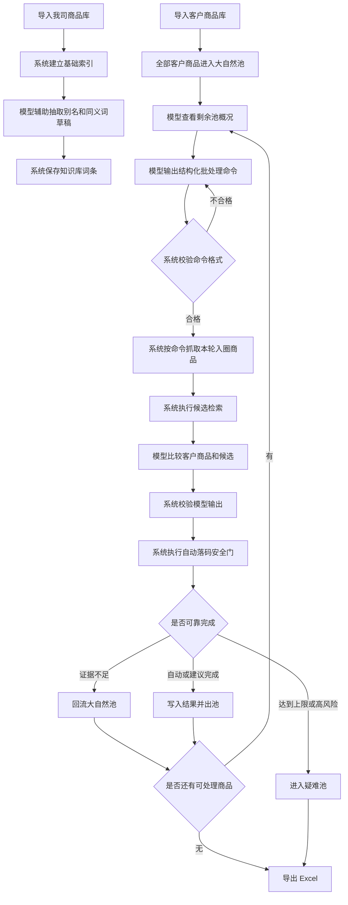

# 003号系统模型流程方案：统一主方案

版本：v0.1  
日期：2026-04-26  
状态：当前主方案  
来源：整合 002 号方案和 002.1 号结构化补强  

## 1. 一句话结论

**模型发令，系统执行；商品多轮入圈，失败回大自然；知识库只管别名和同义词；自动落码必须有证据；人工只处理最后少数疑难。**

这就是三期当前确认的系统模型流程主方案。

## 2. 方案目标

003 号方案要解决的问题：

- 不让系统用死板规则主导语义判断。
- 不让模型完全放飞，凭感觉乱落码。
- 不按客户分类或我司分类硬分批。
- 按商品共同特征多轮处理。
- 尽量减少人工干预。
- 保证自动落码严重错误为 0。

本方案的核心思想：

**模型负责看懂和发令，系统负责执行、记录和安全刹车。**

## 3. 角色边界

### 3.1 模型：发令者

模型负责：

- 理解客户商品和我司商品的语义。
- 识别商品共同特征。
- 决定本轮按什么维度入圈。
- 输出结构化批处理命令。
- 比较客户商品和候选商品是否表达同一商品身份。
- 输出中文推荐理由、证据摘要和风险提示。

模型不能：

- 直接写入我司商品库。
- 凭空创造我司商品编码。
- 绕过系统安全校验自动落码。
- 把复杂业务判断直接沉淀成知识库规则。

### 3.2 系统：执行者

系统负责：

- 读取客户商品库和我司商品库。
- 建立商品索引。
- 保存字段确认结果。
- 校验模型发令格式。
- 按模型命令批量检索候选。
- 调用模型比较候选。
- 校验模型输出结构。
- 执行自动落码安全门。
- 管理大自然池、回流次数和疑难池。
- 导出 Excel。
- 记录日志、证据和任务过程。

系统不能：

- 用死板字符串规则替代模型语义判断。
- 把客户分类或我司分类当成唯一分批依据。
- 因为模型一句话就直接落码。
- 静默接受不存在的编码或无法追溯的理由。

### 3.3 知识库：词典

知识库只保存别名和同义词。

第一版知识库不做复杂规则库，不做自动学习大脑。

知识库可以保存：

- 强同义词。
- 地区别名。
- 品牌别名。
- 规格等价。
- 弱相关词。
- 上下位关系。
- 系列或等级标识词。

知识库不能：

- 单独决定自动落码。
- 替代模型判断。
- 替代人工确认争议样本。

### 3.4 人工：最后兜底和校准者

人工不是主流程。

人工负责：

- 处理系统和模型都无法可靠判断的疑难结果。
- 补充或修正我司商品库。
- 审核争议样本。
- 确认可沉淀的别名和同义词。

系统目标不是让人工继续搬砖，而是让人工处理结果反哺下一轮，逐步减少人工干预。

## 4. 核心概念

### 4.1 大自然池

大自然池是所有尚未可靠完成匹配的客户商品集合。

客户商品导入后，默认全部进入大自然池。

每一轮处理时，模型从大自然池中选择一批有共同特征的商品入圈。

本轮处理后：

- 匹配成功的商品出池。
- 匹配失败的商品回流大自然池。
- 多轮仍无法处理的商品进入疑难池。

### 4.2 入圈

入圈不是落码。

入圈只表示：

**这条商品本轮可以按照某个共同特征参加筛选。**

例如：

- 生抽圈。
- 海天品牌圈。
- 500ml 规格圈。
- 番茄/西红柿同义词圈。

入圈后仍然必须经过候选检索、模型比较和系统安全门。

### 4.3 回流

回流表示商品本轮没有可靠匹配成功，重新回到大自然池。

分错圈没有关系。

关键是：

**分错圈后不能在错圈里乱匹配。**

例如 `番茄酱 500g` 误入 `番茄/西红柿` 圈，如果不能证明它和新鲜番茄是同一商品身份，就必须回流，等待后续按 `酱料`、`调味品` 或 `番茄酱` 重新入圈。

### 4.4 疑难池

疑难池是多轮回流后仍无法可靠处理的商品集合。

疑难池不是马上人工。

疑难池处理顺序：

1. 模型逐条精细判断。
2. 系统重新尝试全局检索。
3. 仍不可靠，再导出 Excel 给人工处理。

## 5. 总体流程



## 6. 模型发令格式

模型不能只输出自然语言命令。

模型必须输出结构化命令，系统只执行结构化命令。

### 6.1 批处理命令示例

```json
{
  "round_id": "round_001",
  "round_name": "核心品名_生抽",
  "round_goal": "优先处理疑似生抽商品",
  "entry_dimension": "core_product_name",
  "entry_terms": ["生抽"],
  "entry_alias_terms": ["酱油"],
  "exclude_terms": ["老抽", "蒸鱼豉油", "蚝油", "料酒"],
  "weak_related_terms": ["酱油"],
  "must_check_fields": ["核心品名", "品牌", "规格", "单位", "包装"],
  "hard_conflict_fields": ["核心品名", "品牌", "规格", "单位", "包装"],
  "search_strategy": {
    "company_catalog_scope": "global",
    "candidate_limit": 20,
    "export_candidate_limit": 5
  },
  "model_compare_policy": "compare_only_after_candidates",
  "auto_code_policy": "system_gate_required"
}
```

### 6.2 系统必须校验的命令字段

系统必须检查：

- `round_id` 是否存在。
- `entry_dimension` 是否在允许列表内。
- `entry_terms` 是否存在。
- `exclude_terms` 是否存在。
- `must_check_fields` 是否存在。
- `hard_conflict_fields` 是否存在。
- `candidate_limit` 是否在允许范围内。
- `auto_code_policy` 是否为系统安全门模式。

命令不合格时，系统不执行，应要求模型重新发令或转入疑难策略。

## 7. 允许的入圈维度

第一版只允许以下维度：

| 维度 | 含义 |
|---|---|
| `core_product_name` | 核心品名 |
| `brand` | 品牌 |
| `alias_synonym` | 别名和强同义词 |
| `spec_unit` | 规格和单位 |
| `package_form` | 包装形态 |
| `series_marker` | 系列、等级、厂家标识 |
| `flavor_form` | 口味、形态 |
| `hard_case` | 疑难逐条处理 |

模型不能发明新的入圈维度。

如果后续需要新增维度，必须先修改方案文档，再进入开发。

## 8. 入圈条件和排除条件

每一轮必须同时有：

- 入圈条件。
- 排除条件。
- 必须检查字段。
- 硬冲突字段。

只有入圈条件，没有排除条件，不允许作为正式批处理命令。

### 8.1 排除条件示例

| 处理圈 | 入圈词 | 排除词 | 说明 |
|---|---|---|---|
| 番茄/西红柿 | 番茄、西红柿 | 番茄酱、番茄沙司、番茄汁、番茄锅底 | 防止新鲜蔬菜和加工品误配 |
| 生抽 | 生抽 | 老抽、蒸鱼豉油、蚝油、料酒 | 防止调味品大类误配 |
| 可乐 | 可乐 | 可乐味、可乐鸡翅调料 | 防止口味词误配 |
| 牛奶 | 牛奶 | 牛奶味、奶糖、奶茶 | 防止原品和风味品误配 |
| 500ml瓶装 | 500ml、500毫升 | 500g、500克、箱、桶 | 防止容量重量和包装混淆 |

### 8.2 回流条件

商品入圈后出现以下情况，应回流大自然池：

- 只有字面相似，没有商品身份一致证据。
- 命中排除词。
- 候选只有大类相关，没有具体品名一致。
- 规格、单位或包装不清楚。
- 模型无法解释为什么是同一商品身份。
- 系统安全门无法通过。

## 9. 大自然池回流终止规则

大自然池不能无限循环。

每条客户商品必须记录：

- 已参与轮次数。
- 已参与维度。
- 每轮失败原因。
- 是否命中过排除词。
- 是否出现过候选不足。
- 是否出现过候选冲突。

第一版建议：

```text
同一商品最多参与 5 轮入圈。
同一维度最多参与 2 次。
同一商品最多触发 2 次模型逐条比较。
```

超过上限仍未完成，应进入疑难池。

## 10. 知识库词条分级

知识库只保存别名和同义词，但必须分级。

### 10.1 词条类型

| 类型 | 示例 | 作用 | 是否可增强自动落码证据 |
|---|---|---|---|
| 强同义 | 番茄 = 西红柿 | 表达等价 | 可以 |
| 地区别名 | 土豆 = 马铃薯 | 地区叫法 | 可以 |
| 品牌别名 | HT = 海天 | 品牌表达等价 | 可以 |
| 规格等价 | 500ml = 500毫升 = 0.5L | 规格换算 | 可以 |
| 弱相关 | 生抽 ~ 酱油 | 扩展检索 | 不可以 |
| 上下位 | 生抽属于酱油类 | 扩展检索和解释 | 不可以 |
| 系列标识 | 金标、银标、特级 | 身份辅助信号 | 只可辅助 |
| 口味形态 | 原味、草莓味、切片、整颗 | 身份辅助信号 | 只可辅助 |

### 10.2 词条状态

| 状态 | 含义 | 是否参与自动落码 |
|---|---|---|
| `suggested` | 模型建议，未确认 | 不参与 |
| `trial` | 试用中，只辅助检索 | 不直接参与 |
| `confirmed` | 已确认 | 可作为证据之一 |
| `blocked` | 禁用或证明错误 | 不参与 |

### 10.3 知识库安全原则

- `suggested` 词条不能参与自动落码。
- `trial` 词条只能帮助召回候选。
- 只有 `confirmed` 强同义、品牌别名、规格等价，才可增强自动落码证据。
- 弱相关、上下位关系永远不能单独支持自动落码。
- 知识库词条必须保留来源、创建时间和最后验证时间。

## 11. 模型调用成本策略

模型调用分四档。

### 11.1 零模型调用

以下情况不调用模型：

- 人工已确认且当前我司库编码仍有效。
- 强同义词和规格等价已确认，且候选唯一。
- 明显品牌、规格、单位、包装硬冲突。
- 该商品已超过最大处理轮次，准备导出人工处理。

### 11.2 批次发令调用

模型看剩余池概况，输出本轮处理命令。

适用于：

- 每一轮开始前。
- 大自然池规模仍较大时。
- 需要选择下一轮入圈维度时。

### 11.3 候选比较调用

模型只看：

- 当前客户商品必要字段。
- Top 候选必要字段。
- 当前入圈命令。
- 已确认知识库摘要。

适用于：

- 系统已经找到多个候选。
- 候选相似但无法靠硬规则区分。

### 11.4 疑难逐条调用

只用于疑难池。

适用于：

- 多轮回流后仍未完成。
- 候选冲突严重。
- 客户表达极乱。

## 12. 自动落码机器校验条件

自动落码不能只靠模型置信度。

系统必须能机器校验。

### 12.1 自动落码最低条件

自动落码至少满足：

1. 推荐编码真实存在于当前我司商品库。
2. 核心品名一致，或存在 `confirmed` 强同义关系。
3. 如果客户和候选都有品牌，品牌必须一致或存在 `confirmed` 品牌别名。
4. 如果客户和候选都有规格，规格必须一致或可换算等价。
5. 如果客户和候选都有单位，单位必须一致或存在明确包装换算。
6. 包装形态不能明显冲突。
7. 模型必须给出中文证据摘要。
8. 证据必须能追溯到客户原文、我司商品库字段或已确认知识库。
9. 未命中本轮排除条件。
10. 没有命中硬冲突字段。

### 12.2 禁止自动落码条件

只要出现以下任一情况，禁止自动落码：

- 核心品名冲突。
- 品牌明确冲突。
- 规格明确冲突。
- 单位或包装明确冲突。
- 客户备注中存在改变商品身份的信息。
- 模型推荐了不存在的编码。
- 模型理由无法追溯到原始字段。
- 候选之间差距不足，无法唯一确定。
- 知识库仅有弱相关或上下位关系支撑。
- 该商品本轮命中过排除词。

## 13. 证据链和审计追溯

每条对照结果必须能说明：

- 它在哪一轮被处理。
- 它按什么维度入圈。
- 模型发令内容是什么。
- 系统检索了哪些候选。
- 模型推荐了哪个候选。
- 自动落码安全门是否通过。
- 如果回流，失败原因是什么。
- 如果进入疑难池，累计失败原因是什么。

Excel 导出中建议增加或保留：

- 系统任务行ID。
- 原始行号。
- 处理轮次。
- 入圈维度。
- 入圈关键词。
- 回流次数。
- 推荐我司编码。
- 推荐我司商品名称。
- 推荐理由。
- 证据对齐摘要。
- 风险提示。
- 备选候选。
- 是否需要人工审核。
- 人工确认结果。
- 人工审核备注。

这不是为了增加复杂度，而是为了后续能复盘：到底是模型判断错、系统检索漏、知识库词条错，还是我司库缺商品。

## 14. 运行指标和验收红线

三期目标是减少人工，但不能用错码换人工减少。

### 14.1 必须统计的指标

每轮任务必须统计：

- 客户商品总数。
- 自动落码数量。
- 自动落码但有表达差异数量。
- 建议落码待确认数量。
- 必须人工审核数量。
- 未找到可靠匹配数量。
- 大自然池回流数量。
- 疑难池数量。
- 模型调用次数。
- 人工处理后再次成功数量。

### 14.2 成功方向

系统每轮迭代应追求：

- 自动完成率上升。
- 人工干预率下降。
- 同类问题重复出现次数下降。
- 知识库命中率上升。
- 候选漏召回率下降。

### 14.3 错码红线

以下指标优先级高于自动化率：

- 自动落码严重错误必须为 0。
- 严重错误包括核心品名错、品牌冲突、规格包装冲突、系统或模型脑补客户未表达信息。
- 不能为了减少人工，把建议落码待确认伪装成自动落码。
- 不能为了提高完成率，把未找到可靠匹配伪装成有编码。

## 15. 验证样本要求

003 方案进入开发前，应准备最小验证样本。

建议样本类型：

- 明确一一对应样本。
- 同义词样本，例如番茄/西红柿。
- 弱相关但不能等同样本，例如生抽/酱油。
- 系列标识样本，例如海天金标生抽。
- 规格冲突样本，例如 500ml 对 1.9L。
- 包装冲突样本，例如瓶装对箱装。
- 加工品误入样本，例如番茄酱误入番茄圈。
- 我司库缺失样本。
- 客户字段混乱样本。

每条验证样本至少应包含：

- 客户原始记录。
- 我司正确商品编码或无匹配结论。
- 人工标准答案。
- 是否允许自动落码。
- 不允许自动落码的原因。

没有验证样本，就不应扩大自动落码范围。

## 16. 开发模块边界

后续实现建议按以下模块拆分：

| 模块 | 责任 |
|---|---|
| `RoundPlanner` | 接收模型发令，校验批处理命令 |
| `NaturePool` | 管理大自然池、回流次数、疑难池 |
| `KnowledgeLexicon` | 管理别名和同义词分级 |
| `CandidateExecutor` | 根据模型命令执行检索 |
| `CandidateComparator` | 调用模型比较客户商品和候选 |
| `AutoCodeGate` | 自动落码机器校验 |
| `RunMetrics` | 统计成本、回流、人工干预和错码指标 |
| `AuditTrail` | 记录每条结果的证据链和过程 |
| `ExcelExporter` | 导出总表、证据表、统计表和元数据 |

第一版不需要每个模块都做复杂。

但代码边界必须按这些责任拆开。

## 17. 当前不做

003 方案第一版不做：

- 大规模自动学习。
- 模型精调。
- 多模型投票。
- 完整知识库管理后台。
- 页面人工审核工作台。
- 页面候选解释工作台。
- 云端 SaaS。
- 让知识库直接决定自动落码。

这些以后可以做，但不能进入当前 3.1 主线。

## 18. 003 结论

003 号方案作为三期当前统一主方案。

它不是“系统主导”，也不是“模型放飞”。

它的正确定位是：

**模型负责理解和发令，系统负责执行和刹车，知识库负责词典，人工负责少数疑难校准。**

如果后续开发出现分歧，以 003 号方案为准。

